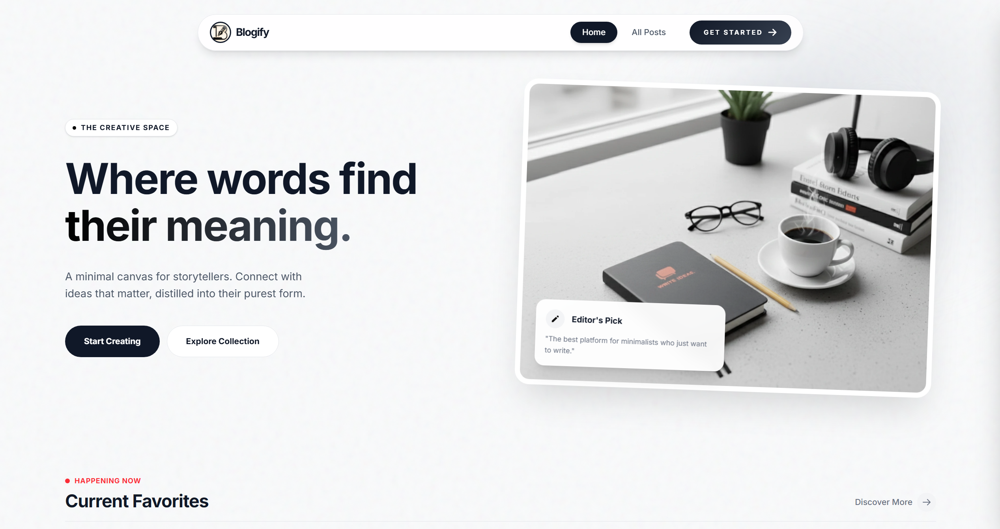
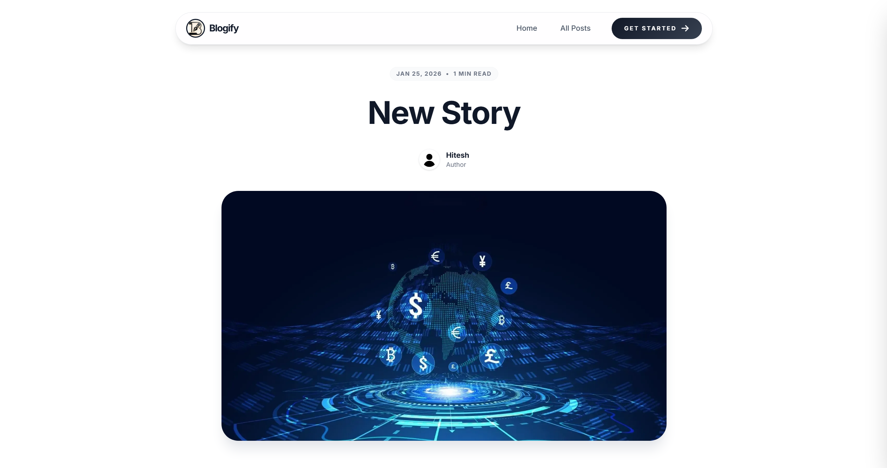
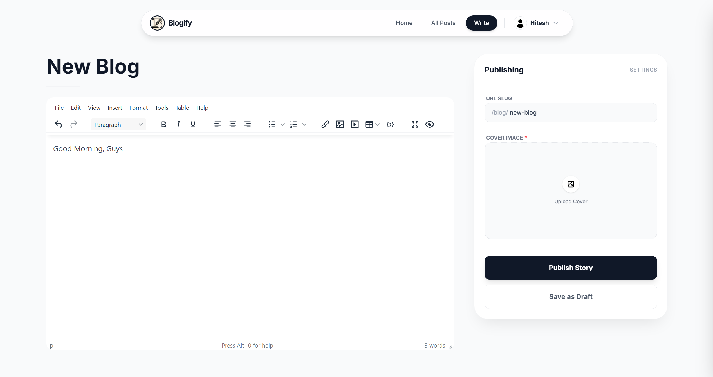
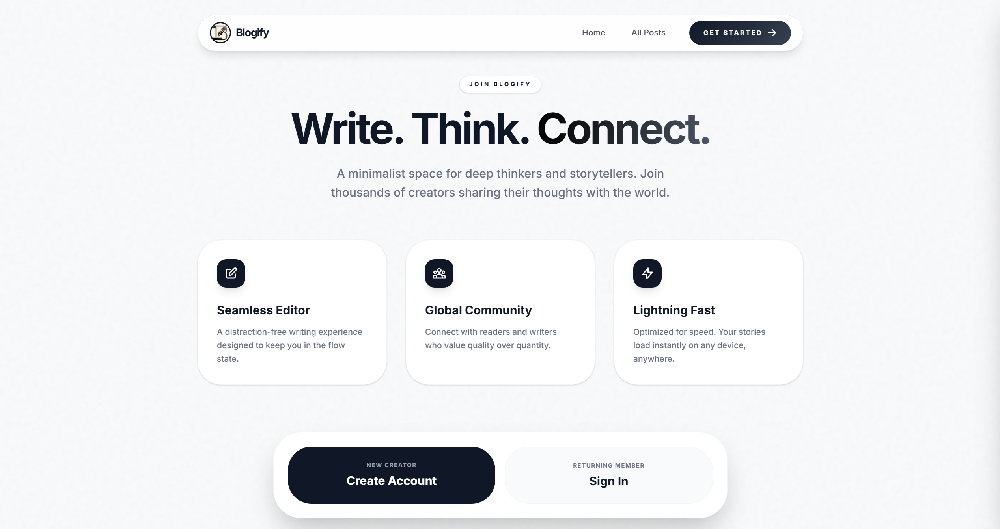
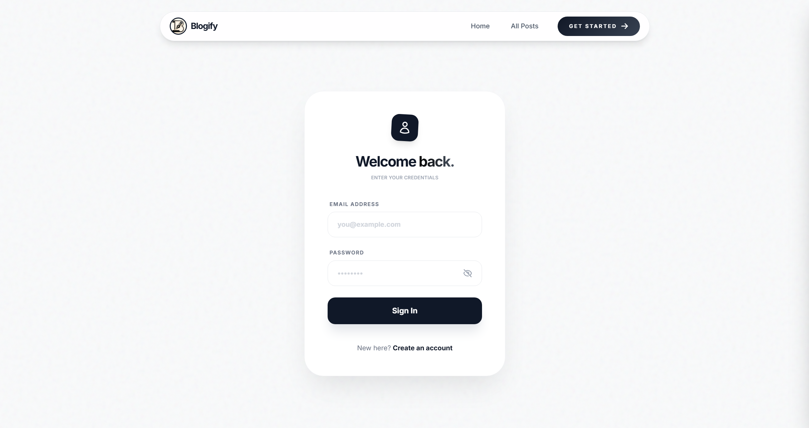

# 🔗 Blogify - Premium Blogging Platform


[](https://blogify-teab.onrender.com/)

A robust, full-featured blogging platform built with **Node.js**, **Express**, and **MongoDB**. Focuses on performance, a premium reading experience, and powerful content management with rich text editing and image optimization.

<p align="center">
  <a href="https://blogify-teab.onrender.com/" target="_blank">
    
  </a>
</p>

---

## ✨ Features

### Content Management & Editing
- **Rich Content Editor:** Integrated TinyMCE WYSIWYG editor for professional blog post formatting
- **Smart Image Optimization:** Client-side compression before upload, secure Multer handling, and dynamic Cloudinary delivery for blazing fast load times
- **Draft/Publish System:** Save your work in progress with auto-save to localStorage and a robust draft/publish status system

### User Engagement
- **Interactive Comments:** Full, robust commenting system on articles
- **Live Reactions:** AJAX-powered live likes and engagement tracking
- **Analytics:** Unique view counter meticulously tracking views for each post
- **Advanced Search:** Full-text search capabilities allowing users to find posts instantly by title or content

### Authentication & Security
- **Bcrypt Security:** Passwords are hashed with bcrypt for maximum security :lock:
- **JWT & Cookie Security:** Secure, stateless authentication with JWT stored in HTTP-only cookies
- **User Experience Enhancements:** Built-in password visibility toggles and seamless login/signup flows

### Essential Utilities
- **Direct Mail System:** Integrated Nodemailer allowing users to contact admins directly from the platform
- **Responsive Design:** Styled heavily with TailwindCSS ensuring a flawless experience across mobile, tablet, and desktop

---

## 🛠️ Tech Stack

### Backend
- **Node.js** - Runtime environment
- **Express.js** - Web framework
- **MongoDB** - Database
- **Mongoose** - ODM for MongoDB
- **JWT** - JSON Web Tokens for authentication
- **bcrypt** - Password hashing
- **Cookie-Parser** - Cookie handling

### Frontend
- **EJS** - Embedded JavaScript Templates (Server-Side Rendering)
- **TailwindCSS** - Utility-first CSS framework for rapid UI development
- **TinyMCE** - Rich text editor
- **Browser-Image-Compression** - Client-side image optimization

### Services & Utilities
- **Cloudinary** - Cloud image storage and dynamic optimization
- **Multer** - Middleware for handling `multipart/form-data`
- **Nodemailer** - Email sending system
- **Resend** - Alternative email API integration
- **Dotenv** - Environment variables configuration

---

## 📁 Project Structure

```
blog-app/
├── controller/
│   ├── blog.js                   # Blog posts & engagement logic
│   ├── static.js                 # Static pages & contact logic
│   └── user.js                   # Authentication logic
├── middlewares/
│   └── auth.js                   # JWT Authentication & authorization
├── models/
│   ├── blog.js                   # Schema for blog posts
│   ├── comment.js                # Schema for comments
│   ├── user.js                   # Schema for users
│   └── viewLog.js                # Schema for tracking post views
├── routes/
│   ├── blog.js                   # Routes for blog operations
│   ├── staticRouter.js           # Routes for public pages
│   └── user.js                   # Routes for authentication
├── services/
│   ├── authentication.js         # JWT generation and validation
│   └── upload.js                 # Multer & Cloudinary configuration
├── public/
│   ├── css/                      # Tailwind styles
│   ├── images/                   # Static local assets
│   └── js/                       # Client-side scripts
├── views/
│   ├── partials/                 # Reusable EJS components (head, nav, etc.)
│   ├── home.ejs                  # Main feed page
│   ├── blog.ejs                  # Individual blog post view
│   ├── addblog.ejs               # TinyMCE editor page for posting
│   ├── login.ejs                 # Login interface
│   └── signup.ejs                # Registration interface
├── index.js                      # Server entry point
├── package.json                  # Dependencies
└── tailwind.config.js            # Tailwind configuration
```

---

## 🚀 Getting Started

### Prerequisites

* **Node.js** (v18 or higher recommended)
* **MongoDB** (Local installation or MongoDB Atlas cluster)
* **Cloudinary Account** (for image hosting)

### Installation

1. Clone the repository and install dependencies:

```bash
git clone https://github.com/HiteshShonak/Blogify-Node-Express-EJS.git
cd Blogify-Node-Express-EJS
npm install
```

2. Create a `.env` file in the root directory and add your credentials:

```env
PORT=8000
MONGODB_URL=your_mongodb_connection_string
COOKIE_SECRET=your_super_secret_cookie_key
CLOUDINARY_CLOUD_NAME=your_cloudinary_name
CLOUDINARY_API_KEY=your_cloudinary_api_key
CLOUDINARY_API_SECRET=your_cloudinary_api_secret
TINYMCE_API_KEY=your_tinymce_api_key
GMAIL_USER=your_email@gmail.com
GMAIL_PASS=your_app_password
BASE_URL=http://localhost:8000
```

3. Start the application:

```bash
# Build CSS (in one terminal)
npm run build:css

# Start Dev Server (in another terminal)
npm start
```

4. Access the application at `http://localhost:8000`

---

## 📸 Screenshots

### Home Feed


### Reading Experience


### Rich Text Editor


### Getting Started


### Authentication


---

## 🔑 Environment Variables

| Variable | Description | Required |
|----------|-------------|----------|
| `PORT` | Server port (default: 8000) | No |
| `MONGODB_URL` | MongoDB connection string | Yes |
| `COOKIE_SECRET` | Secret key for JWT encryption | Yes |
| `CLOUDINARY_*` | Cloudinary API credentials | Yes |
| `TINYMCE_API_KEY` | TinyMCE Editor Key | Yes |
| `GMAIL_*` | Nodemailer credentials (or use RESEND_API_KEY) | Yes |

---

## 🤝 Contributing

Contributions are welcome! Please follow these steps:

1. Fork the repository
2. Create a feature branch (`git checkout -b feature/AmazingFeature`)
3. Commit your changes (`git commit -m 'Add some AmazingFeature'`)
4. Push to the branch (`git push origin feature/AmazingFeature`)
5. Open a Pull Request

---

## 👤 Author

**Hitesh**

* GitHub: [@HiteshShonak](https://github.com/HiteshShonak)

---

**Note:** This is a personal project built primarily to showcase backend development skills, server-side rendering with EJS, and modern full-stack workflows.
